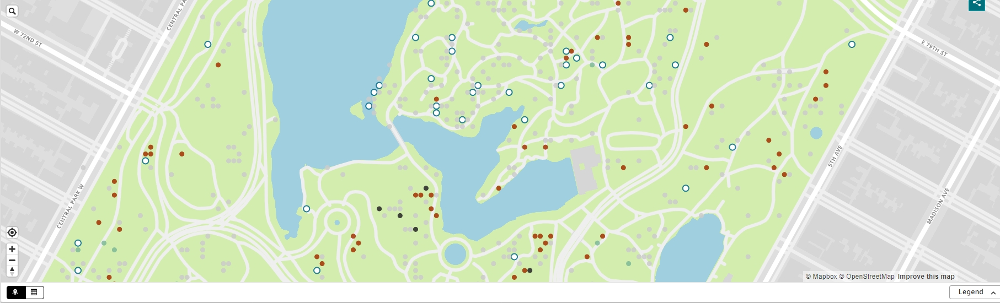

# Central Park Squirrel Census

Esse repositório apresenta um pouco dos resultados de meus estudos como estudante de ciência de dados. Meu objetivo é praticar durante minhas férias da faculdade com dados disponíveis publicamente.

- O Squirrel Census é um projeto multimídia de ciência, design e contação de histórias com foco no cinza oriental (Sciurus carolinensis). Eles contam esquilos e apresentam suas descobertas ao público. A tabela utilizada no meu trabalho, contém dados de esquilos para cada um dos 3.023 avistamentos, incluindo coordenadas de localização, idade, cor primária e secundária da pelagem, elevação, atividades, comunicações e interações entre esquilos e com humanos.

-----------------------

Fonte: https://data.cityofnewyork.us/Environment/2018-Central-Park-Squirrel-Census-Squirrel-Data/vfnx-vebw/about_data

-----------------------
# Meu objetivo nesta pesquisa:

## Limpeza e Pré-processamento de Dados (Objetivos Iniciais):

1. **Lidando com valores ausentes:** Detectar presença de valores ausentes (`null`, `NaN`, espaços em branco).

2. **Formato de data:** A coluna "Date" está no formato `MMDDYYYY`.

3. **Variáveis booleanas:** Muitas colunas são booleanas (verdadeiro/falso).

4. **Tratamento de coordenadas:** A coluna "Lat/Long" contém strings. Conversão necessária para um formato numérico (duas colunas separadas para latitude e longitude).

5. **Limpeza de strings:** Isolar colunas que serão desnecessárias para o projeto.

## II. Análise Exploratória de Dados (Objetivos Intermediários):

1. **Distribuição de cores de pelagem:**  visualizar a frequência de cada cor de pelagem primária e secundária.  Identificar as cores mais comuns.

2. **Idade dos esquilos:**  Analisar a distribuição de idade.  Há uma diferença significativa entre a proporção de esquilos adultos e jovens?

3. **Atividades dos esquilos:**  Analisar a frequência de diferentes atividades (Running, Chasing, Climbing, etc.).  Há correlações entre as atividades? Quais atividades são mais comuns em esquilos adultos versus jovens?

4. **Localização:** Uso de coordenadas para criar um mapa da localização dos esquilos.  Existem áreas mais densamente povoadas por esquilos?  Há relação entre a localização e a cor da pelagem ou atividade?

5. **Correlações entre variáveis:** Explorar possíveis correlações entre variáveis usando métodos estatísticos e matrizes de correlação.
